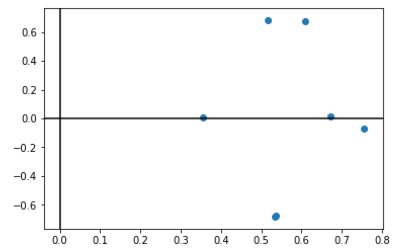
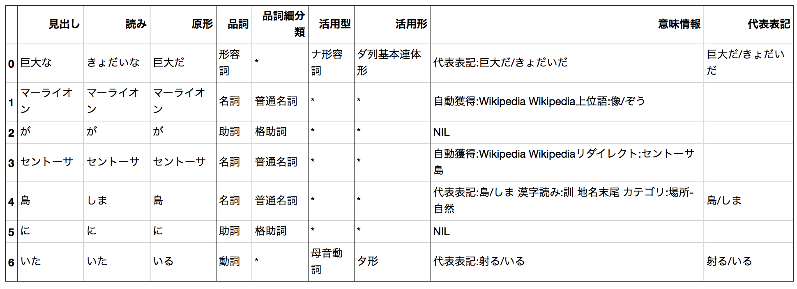
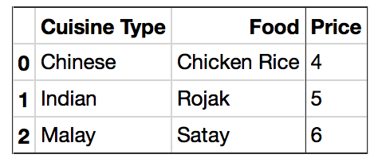
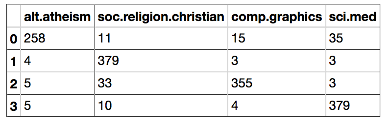
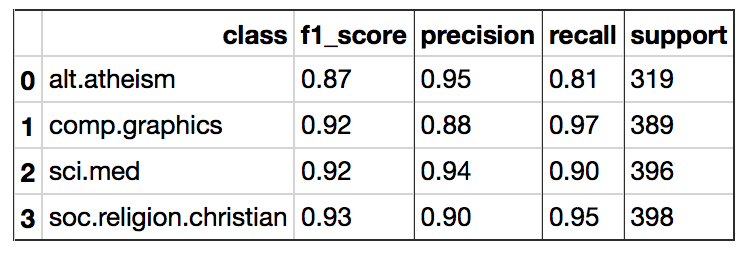
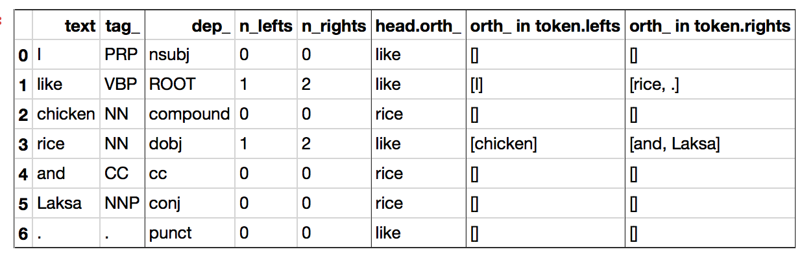
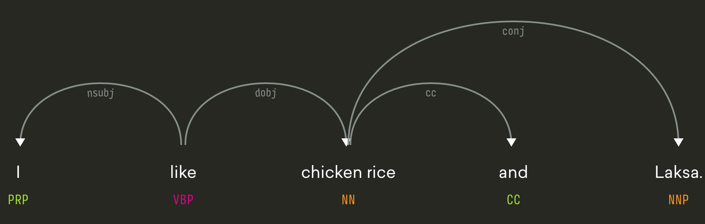
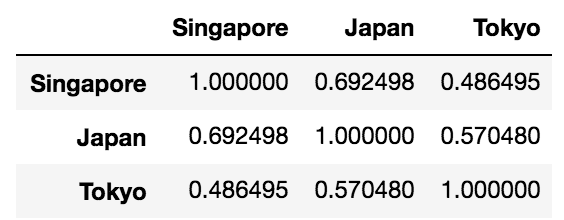
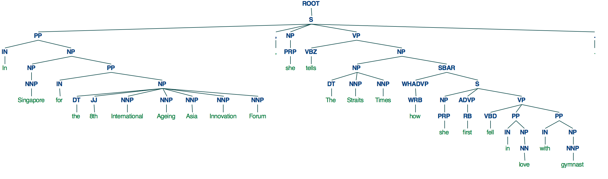

# NLP Tools Verification


A project to explore several NLP tools/libraries, including behavior verification and funcitonarity check.  


## Vefication: CaboCha
***Purpose*** To verify behavior of CaboCha

***Keywords*** Feature extraction, Tree Generation, Dependency Analysis

### Sample Input and Output:

```
str = "巨大なマーライオンがセントーサ島にいた"  
```

Tree representation

```
        巨大な-D    
  マーライオンが---D
    セントーサ島に-D
                いた
EOS
```

Link representation

```
巨大な  =>  マーライオンが
マーライオンが  =>  いた
セントーサ島に  =>  いた
```

## Vefication: gensim
***Purpose*** To measure similarity of documents, To summarize a document

***Keywords*** gensim, bag-of-words, TF-IDF, Latent Semantic Indexing, Summarization

### Sample Input and Output (Similarity Measurement):

```
documents = ["Singapore tops talent competitiveness index in Asia Pacific for the 4th year running Globally",
 "Singapore is ranked second behind Switzerland, also for the fourth consecutive year",
 "Singapore on Tuesday (Apr 18) retained its top spot in Asia Pacific for the fourth consecutive year in the Global Talent Competitiveness Index",
 "Globally, Singapore is ranked second behind Switzerland, also for the fourth year running",
 "The report, which was announced during GTCI’s regional launch at the INSEAD Asia campus in Singapore, focused on talent and technology",
 "This year’s GTCI report shows that countries in the Asia Pacific region demonstrate strong talent readiness for technology",
 "Digital technologies will help small and exposed economies like Singapore punch above their weight by creating means for their businesses and talent to reach out to the global market"
] 
```

BOW vector

```
[(0, 1.0), (1, 1.0), (2, 1.0), (3, 1.0), (4, 1.0), (5, 1.0), (6, 1.0), (7, 1.0)]
[(5, 1.0), (7, 1.0), (8, 1.0), (9, 1.0), (10, 1.0), (11, 1.0), (12, 1.0), (13, 1.0)]
[(0, 1.0), (1, 1.0), (2, 1.0), (3, 1.0), (5, 1.0), (6, 1.0), (7, 1.0), (9, 1.0), (10, 1.0), (14, 1.0)]
[(4, 1.0), (5, 1.0), (7, 1.0), (8, 1.0), (10, 1.0), (11, 1.0), (12, 1.0), (13, 1.0)]
[(0, 1.0), (6, 1.0), (15, 1.0)]
[(0, 1.0), (3, 1.0), (6, 1.0), (15, 1.0)]
[(5, 1.0), (6, 1.0), (14, 1.0)]
```

TF-IDF vector

```
[(0, 0.22333011474013234), (1, 0.4999496145890451), (2, 0.4999496145890451), (3, 0.33813758020918966), (4, 0.4999496145890451), (5, 0.13427852614507685), (6, 0.13427852614507685), (7, 0.22333011474013234)]
[(5, 0.11221120957845192), (7, 0.1866280709933418), (8, 0.41778795606310304), (9, 0.41778795606310304), (10, 0.2825680916262805), (11, 0.41778795606310304), (12, 0.41778795606310304), (13, 0.41778795606310304)]
[(0, 0.19120290039161436), (1, 0.42802922691517054), (2, 0.42802922691517054), (3, 0.2894947067153461), (5, 0.11496185227471352), (6, 0.11496185227471352), (7, 0.19120290039161436), (9, 0.42802922691517054), (10, 0.2894947067153461), (14, 0.42802922691517054)]
[(4, 0.41778795606310304), (5, 0.11221120957845192), (7, 0.1866280709933418), (8, 0.41778795606310304), (10, 0.2825680916262805), (11, 0.41778795606310304), (12, 0.41778795606310304), (13, 0.41778795606310304)]
[(0, 0.3961244212688575), (6, 0.23817210464404653), (15, 0.8867691308586684)]
[(0, 0.3397097968012109), (3, 0.5143446453577409), (6, 0.20425248464403806), (15, 0.7604786402429963)]
[(5, 0.2510817518912483), (6, 0.2510817518912483), (14, 0.9348346954057938)]
```

LSI vector

```
[(0, 0.6720573142811622), (1, 0.010830018112295434)]
[(0, 0.5326169626752311), (1, -0.6819120577356104)]
[(0, 0.7559738905430721), (1, -0.06763399458337703)]
[(0, 0.5349921559842177), (1, -0.6733147959206227)]
[(0, 0.5172197653188824), (1, 0.680916991519212)]
[(0, 0.609178991307313), (1, 0.6765398096430153)]
[(0, 0.3560677538145509), (1, 0.008283926460691204)]
```
LSI plot on 2D map


Similarity using LSI vector

```
[(0, 0.9636234),
 (6, 0.9626515),
 (2, 0.92485464),
 (5, 0.91847587),
 (4, 0.8880485),
 (3, 0.3383578),
 (1, 0.3314538)]
```
### Sample Input and Output (Document Summarization):

Original

```
text = "Thomas A. Anderson is a man living two lives. By day he is an " + \
    "average computer programmer and by night a hacker known as " + \
    "Neo. Neo has always questioned his reality, but the truth is " + \
    "far beyond his imagination. Neo finds himself targeted by the " + \
    "police when he is contacted by Morpheus, a legendary computer " + \
    "hacker branded a terrorist by the government. Morpheus awakens " + \
    "Neo to the real world, a ravaged wasteland where most of " + \
    "humanity have been captured by a race of machines that live " + \
    "off of the humans' body heat and electrochemical energy and " + \
    "who imprison their minds within an artificial reality known as " + \
    "the Matrix. As a rebel against the machines, Neo must return to " + \
    "the Matrix and confront the agents: super-powerful computer " + \
    "programs devoted to snuffing out Neo and the entire human " + \
    "rebellion. "
```

Summarized

```
Morpheus awakens Neo to the real world, a ravaged wasteland where most of humanity have been captured by a race of machines that live off of the humans' body heat and electrochemical energy and who imprison their minds within an artificial reality known as the Matrix.
```

## Vefication: KNP
***Purpose*** To perform morphological analysis with Juman as well as dependency analysis using KNP

***Keywords*** Morphological analysis, Dependency Analysis

### Sample Input and Output

Input

```
str = "巨大なマーライオンがセントーサ島にいた"
```
Output (morphological analysis)


Output (dependency analysis)

```
['巨大な'] => ['マーライオン', 'が']
['マーライオン', 'が'] => ['いた']
['セントーサ', '島', 'に'] => ['いた']
```


## Vefication: NLTK
***Purpose*** To perform sentimental analysis of movie review corpus using NLTK

***Keywords*** Sentimental Analysis, Classification, Naive Bayes, Logistic Regresssion

### Sample Input and Output

Display sample dataset

```
'neg/cv000_29416.txt',
 'neg/cv001_19502.txt',
 'neg/cv002_17424.txt',
 'neg/cv003_12683.txt',
 'neg/cv004_12641.txt',
 'neg/cv005_29357.txt',
 'neg/cv006_17022.txt',
 'neg/cv007_4992.txt',
 'neg/cv008_29326.txt',
 'neg/cv009_29417.txt']
```
Logistic regression model precision

```
accuracy(sk_classifier, test_feats)
```
```
0.892
```

Sample test (negative)

```
negfeat = bag_of_words(['the', 'plot', 'was', 'ludicrous'])  
sk_classifier.classify(negfeat)  
```

```
'neg'
```

Sample test (positive)

```
posfeat = bag_of_words(['that', 'was', 'a', 'wonderful','moment'])
sk_classifier.classify(posfeat)
```

```
'pos'
```

## Vefication: Pandas
***Purpose*** To understand difference between Series and DataFrame, and perform some processing to a DataFrame

***Keywords*** Pandas, Data Format

### Sample Input and Output

Input

```
data ={'Cuisine Type':['Chinese', 'Indian','Malay'],
      'Food':['Chicken Rice','Rojak','Satay'],
      'Price':[4,5,6]}
```

dataframe in table format



Output (count)

```
df.count()
```

```
Cuisine Type    3
Food            3
Price           3
dtype: int64
```


## Vefication: scikit-learn
***Purpose*** To classify news with using scikit-learn's NB classifier and perform hyper parameter tuning

***Keywords*** Naive Bayes, Pipeline, Hyperparameter Tuning, Grid search

### Sample Input and Output

Input (cateogy)

```
['alt.atheism', 'comp.graphics', 'sci.med', 'soc.religion.christian']
```

Input (news sample)

```
('From: sd345@city.ac.uk (Michael Collier)\n'  
 'Subject: Converting images to HP LaserJet III?\n'  
 'Nntp-Posting-Host: hampton\n'  
 'Organization: The City University\n'  
 'Lines: 14\n'  
 '\n'  
 'Does anyone know of a good way (standard PC application/PD utility) to\n'  
 'convert tif/img/tga files into LaserJet III format.  We would also like to\n'  
 'do the same, converting to HPGL (HP plotter) files.\n'  
 '\n'  
 'Please email any response.\n'  
 '\n'  
 'Is this the correct group?\n'  
 '\n'  
 'Thanks in advance.  Michael.\n'  
 '-- \n'  
 'Michael Collier (Programmer)                 The Computer Unit,\n'  
 'Email: M.P.Collier@uk.ac.city                The City University,\n'  
 'Tel: 071 477-8000 x3769                      London,\n'  
 'Fax: 071 477-8565                            EC1V 0HB.\n')  
```

Feature extraction (TF-IDF)

```
<class 'scipy.sparse.csr.csr_matrix'>  
  (0, 14887)	0.016797806021219684  
  (0, 29022)	0.1348710554299733  
  (0, 8696)	0.314400065528974  
  (0, 4017)	0.12491817585060791  
  (0, 33256)	0.11819702490105698  
  (0, 21661)	0.1962279892331408  
  (0, 9031)	0.3841803935867984  
  (0, 31077)	0.016797806021219684  
  (0, 9805)	0.21567205914741705  
  (0, 17366)	0.0744441018788533  
  (0, 32493)	0.07283773941616518  
```

Performance Evaluation


Confusion Matrix


Grid search

```
gs_clf.best_score_
```

```
0.9
```
## Vefication: spaCy
***Purpose*** To perform parsing and entity recognition using spaCy

***Keywords*** Tokenization, POS tagging, Dependency analysis, Words similarity measurement, Entity recognition

### Sample Input and Output

Input (Pos tagging)

```
text = u"We are living in Singapore.\nIt's blazing outside today!\n"
```
Output (Pos tagging)

```
('We', '-PRON-', 'PRP', 'PRON')
('are', 'be', 'VBP', 'VERB')
('living', 'live', 'VBG', 'VERB')
('in', 'in', 'IN', 'ADP')
('Singapore', 'singapore', 'NNP', 'PROPN')
('.', '.', '.', 'PUNCT')
('\n', '\n', '', 'SPACE')
('It', '-PRON-', 'PRP', 'PRON')
("'s", 'be', 'VBZ', 'VERB')
('blazing', 'blaze', 'VBG', 'VERB')
('outside', 'outside', 'RB', 'ADV')
('today', 'today', 'NN', 'NOUN')
('!', '!', '.', 'PUNCT')
('\n', '\n', '', 'SPACE')
```

Input (Dependency Analysis)

```
doc_dep = nlp(u'I like chicken rice and Laksa.')
```

Output



```
[]<---I[nsubj]--->[]
--------
['I']<---like[ROOT]--->['rice', '.']
--------
[]<---chicken[compound]--->[]
--------
['chicken']<---rice[dobj]--->['and', 'Laksa']
--------
[]<---and[cc]--->[]
--------
[]<---Laksa[conj]--->[]
--------
[]<---.[punct]--->[]
--------
```

Output (spaCy Web tool)


Input (Word Similarity)

```
tokens = nlp(u'Singapore Japan Tokyo')
```

Output (Word Similarity using word embedding)


Input (Entity Recognition)

```
example_sent = "NTUC has raised S$25 million to help workers re-skill and upgrade their skills, secretary-general Chan Chun Sing said at the May Day Rally on Monday "
```

Output (Entity Recognition)

```
('NTUC', 'ORG')
('has', '(not an entity)')
('raised', '(not an entity)')
('S$25', 'CARDINAL')
('million', 'CARDINAL')
('to', '(not an entity)')
('help', '(not an entity)')
('workers', '(not an entity)')
('re', '(not an entity)')
('-', '(not an entity)')
('skill', '(not an entity)')
('and', '(not an entity)')
('upgrade', '(not an entity)')
('their', '(not an entity)')
('skills', '(not an entity)')
(',', '(not an entity)')
('secretary', '(not an entity)')
('-', '(not an entity)')
('general', '(not an entity)')
('Chan', 'PERSON')
...
```

Output (Built Own Entity Recognition Model)

```
Entities [('Daphne Khoo', 'PERSON')]
Tokens [('Who', '', 2), ('is', '', 2), ('Daphne', 'PERSON', 3), ('Khoo', 'PERSON', 1), ('?', '', 2)]
Entities [('Bangkok', 'LOC'), ('Buangkok', 'LOC')]
Tokens [('I', '', 2), ('like', '', 2), ('Bangkok', 'LOC', 3), ('and', '', 2), ('Buangkok', 'LOC', 3), ('.', '', 2)]
```

## Vefication: Stanford Parser
***Purpose*** To run java NLP library(Stanford Parser) from Python environment

***Keywords*** Dependency Representation, Tree Representation Parsing

### Sample Input and Output

Input

```
sentence = 'In Singapore for the 8th International Ageing Asia Innovation Forum, she tells The Straits Times how she first fell in love with gymnast.'
```

Output

```
(ROOT
  (S
    (PP
      (IN In)
      (NP
        (NP (NNP Singapore))
        (PP
          (IN for)
          (NP
            (DT the)
            (JJ 8th)
            (NNP International)
            (NNP Ageing)
            (NNP Asia)
            (NNP Innovation)
            (NNP Forum)))))
    (, ,)
    (NP (PRP she))
    (VP
      (VBZ tells)
      (NP
        (NP (DT The) (NNP Straits) (NNP Times))
        (SBAR
          (WHADVP (WRB how))
          (S
            (NP (PRP she))
            (ADVP (RB first))
            (VP
              (VBD fell)
              (PP (IN in) (NP (NN love)))
              (PP (IN with) (NP (NNP gymnast))))))))
    (. .)))
```

Output (Tree)



## Environment
- Python 3.6

## Reference

* Cabocha  
https://taku910.github.io/cabocha/


* gensim  
https://radimrehurek.com/gensim/

* KNP  
http://fvcrc.i.nagoya-u.ac.jp/~sasano/knp/

* NLTK  
https://www.nltk.org/

* Pandas  
http://pandas.pydata.org/

* scikit-learn  
http://scikit-learn.org/

* spaCy  
https://spacy.io/

* Stanford Parser  
https://nlp.stanford.edu/software/lex-parser.shtml